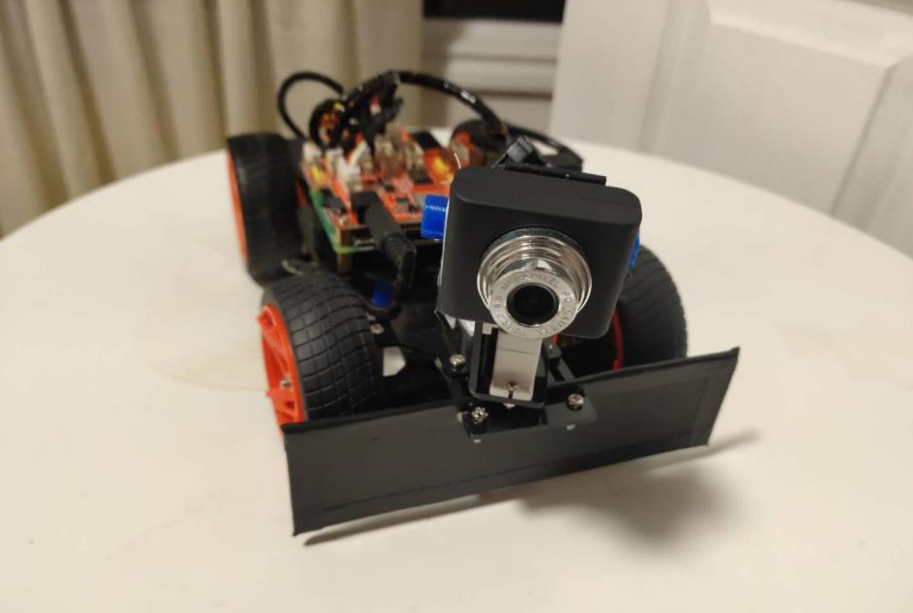

# Vison_Based_Robotic_Lawn_Mower

# Motivation
A main inconvenience of existing robotic lawn mower on the market is that they all require 
boundary wires installed in order to define the operating areas. These wires not only cost 
extra, but also take quite a long time to set up. Another problem of the existing product is that 
they are only able to operate following randomized paths, which takes a very long time to 
cover the entire area, and may cause the lawn to look messy.
We want to improve the overall user experience by using image recognition technology to 
limit the range of movement instead, therefore eliminating the use of boundary wires entirely. 
And also improving cutting efficiency and the aesthetic presentation by introducing path 
planning algorithm.

# Introduction
An vison based autonoumous lawn mower that is caple of efficient navigation and stay within lawn region. Python language was used to handle image processing and control tasks. 
Linux were used to set up a IP camera from Raspberry Pi and Raspberry Pi camera module.

##Hardware:
- Two DC motors
- Camera module
- 3 servo motors
- Raspberry Pi 3 Model B+
- PCF8591 AD Converter
- PCA9685 PWM/Servo Driver I2C Interface
- TB6612 Motor Drive
- Charging Station with built-in ultrasonic sensor and a Arduino Uno 

## Software:
Cutting Mode: 
While in cutting mode, the lawn mower will keep processing the images and 
determine if it’s on the lawn and there is no obstacle ahead, if it’s true, it will keep going 
forward doing the work, otherwise, the lawn mower will back, turn certain degree and detect 
until it is far from the boundary. Then go straight again.
Finding Charging Station Mode: 
The software will enter automatic charging mode when the battery is low and the 
camera will be tilted up to preset position. Then it will start scanning for the red circle. If the 
red circle is found, the position of the red circle appears in the screen will be calculated and 
the camera will adjust its position to put the center of the red circle close to the center of the 
screen. When the camera changing the position the front wheel will also change directions 
step by step in order to make the lawn mower facing the charging station. Meanwhile, the car 
will keep moving forward towards the red circle and when the red circle’s diameter versus 
screen height ratio reach preset point, the lawn mower will stop and exit finding charging 
station mode.
If the red circle is not found in the first scan, the lawn mower will turn certain degrees and 
detect again. After three times turning, the camera scan range can cover the whole 360 
degrees
## Image Processing
Three of our main functions involved certain level of image processing. 
For lawn mowing and obstacles detection function, we first have our camera tilting down 
looking to the ground. And we use color detection algorithm to judge if the lawn mower is 
inside the operating area or not. More specifically, we will first preprocess the image to 
reduce all the noise, and reduce the effect of different lighting. Then we will segment out the 
green area, and draw a contour around it. And compute the ratio of green area with respect to 
whole area. For example, 90% of green area means we are inside the lawn or not obstacles 
blocking the way. 
For the automatic charging function, we have the camera tilled up to looking for the charging 
station actively. It use shape detection algorithm. The target would be the red circle located 
on the charging station. Hough transform is used here to find the circle shape. After the circle 
is found, we will calculated the position of the circle center and feed the output to our control 
algorithm to navigate, simultaneously we will compare the diameter of the circle to the image 
height to decide when the robot need to stop.
# Implementation
The camera is connected directly to the Raspberry Pi and there is the hat circuit board with 
the PCF8591 AD Converter build in on top of the Raspberry Pi. Then there is a PCA9685 
PWM/Servo Driver with I2C Interface which connects the hat circuit board and the TB6612 
DC motor drive. Three servo drivers are connected to the PWM/Servo Driver and two DC 
motors are connected to the TB6612 DC motor drive. 
All the code are written in python and saved inside the raspberry pi memory. We use WIFI to 
connect the PC to Raspberry Pi and run the code. There is also server & client code 
implemented for the lawn mower calibration and testing.

